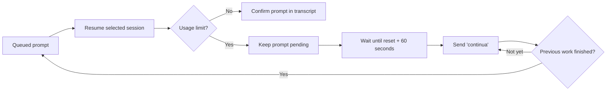

<p align="center">
  
</p>

<h1 align="center">Claude + Codex Queue</h1>

<p align="center">
  Queue prompts for existing Claude Code sessions and Codex App tasks.<br>
  Wait out usage limits, send <code>continua</code>, then resume the queue without wasting the next prompt.
</p>

<p align="center">
  <a href="https://github.com/ravhello/claude-codex-queue/actions/workflows/ci.yml"></a>
  <a href="https://github.com/ravhello/claude-codex-queue/releases/latest"></a>
  
  <a href="https://github.com/ravhello/claude-codex-queue/blob/main/LICENSE"></a>
  <a href="https://github.com/ravhello/claude-codex-queue/stargazers"></a>
</p>

<p align="center">
  <a href="#quick-start">Quick start</a> |
  <a href="#how-limit-recovery-works">Limit recovery</a> |
  <a href="https://github.com/ravhello/claude-codex-queue/blob/main/ROADMAP.md">Roadmap</a> |
  <a href="https://github.com/ravhello/claude-codex-queue/discussions">Discussions</a>
</p>


## Why use it?

AI coding sessions often stop at the usage-limit boundary. Sending the next real
prompt immediately can waste it on another limit response. Claude + Codex Queue
keeps that prompt pending, waits for the reset, resumes the interrupted work
with `continua`, and only then processes the rest of the queue in order.

The app works with sessions you already use. It does not create a separate chat
system and does not require external Anthropic or OpenAI API keys.

## What it supports

| Source | Discover | Queue prompts | Auto-continue | Preserve settings |
| --- | :---: | :---: | :---: | :---: |
| Claude Code in VS Code | Yes | Yes | Yes | Model, effort, permissions |
| Claude Desktop Code sessions | Yes | Yes, when locally resumable | Yes | Model, effort, permissions |
| Claude Code over Remote SSH | Yes | When enough metadata exists | Yes | Remote effective settings |
| Codex App tasks | Yes | Yes | Yes | Model, reasoning, sandbox, approvals |

Additional capabilities:

- newest-real-message sorting across Claude and Codex;
- persistent FIFO queue with per-prompt priorities;
- one-minute safety delay after a parsed reset time;
- multi-account Claude metadata synchronization and chat transfer;
- account mismatch and view-only checks before actions are enabled;
- transcript confirmation after every Codex send;
- local web UI plus a scriptable CLI;
- no runtime Python dependencies outside the standard library.

## Quick start

### Windows app and Desktop shortcut

Requirements: Windows, WSL, Python 3.10+ in WSL, and at least one authenticated
Claude Code or Codex CLI installation.

```powershell
git clone https://github.com/ravhello/claude-codex-queue.git
cd claude-codex-queue
powershell.exe -NoProfile -ExecutionPolicy Bypass -File .\install-desktop-shortcut.ps1
```

Open **Claude + Codex Queue** from the Desktop. The launcher starts the local
server and opens [http://127.0.0.1:8765/](http://127.0.0.1:8765/).

To run it without installing a shortcut:

```powershell
.\start-claude-codex-queue.ps1
```

### Install the CLI from the latest wheel

Run this inside WSL:

```bash
python3 -m pip install claude-codex-queue
claude-codex-queue doctor
claude-codex-queue-web --host 127.0.0.1 --port 8765
```

The source checkout is recommended if you want the Windows launcher and Desktop
shortcut. The wheel is useful for CLI-only installations.

## How limit recovery works



Auto-continue can also monitor a selected session with an empty queue. It sends
nothing while no active limit is detected.

## Safety guarantees

- The project does not bypass or evade provider limits.
- The next queued prompt remains pending when a limit is detected.
- Chat settings are fingerprinted and checked before sending.
- External Anthropic and OpenAI API-key/base-URL overrides are removed from
  child processes, so local CLI authentication remains authoritative.
- Codex dangerous bypass mode is never enabled implicitly.
- Controls are disabled for sessions that are genuinely view-only.
- Queue state and logs stay local under the detected Windows profile.

Read [SECURITY.md](https://github.com/ravhello/claude-codex-queue/blob/main/SECURITY.md) before sharing diagnostics. Never publish private
transcripts, authentication files, tokens, or unredacted logs.

## CLI

```bash
claude-codex-queue doctor
claude-codex-queue list --limit 30
claude-codex-queue add --chat <selector> [--priority 100] "message"
claude-codex-queue status -v
claude-codex-queue check-settings
claude-codex-queue run
claude-codex-queue remove <item-id>
claude-codex-queue reset <item-id>
claude-codex-queue clear
```

`<selector>` accepts a visible row number, session-ID prefix, title fragment,
or working-directory fragment. Multiple messages can be supplied in order or
loaded from `@prompt.md`.

## State and compatibility

New installations use:

```text
<Windows user profile>\.claude-codex-queue
```

Existing installations automatically keep using `.claude-vscode-queue`, so an
upgrade does not reset queues or logs. The old Python modules, commands, and
launcher names remain as compatibility aliases.

## Development

```bash
python3 -m unittest discover -s tests -v
python3 -m build
python3 -m twine check dist/*
```

See [CONTRIBUTING.md](https://github.com/ravhello/claude-codex-queue/blob/main/CONTRIBUTING.md),
[ARCHITECTURE.md](https://github.com/ravhello/claude-codex-queue/blob/main/docs/ARCHITECTURE.md),
and the [roadmap](https://github.com/ravhello/claude-codex-queue/blob/main/ROADMAP.md). Questions and setup help belong in
[Discussions](https://github.com/ravhello/claude-codex-queue/discussions);
reproducible defects belong in
[Issues](https://github.com/ravhello/claude-codex-queue/issues).

## Project status

Current release: **v0.2.2**. The project is alpha software tested on Windows/WSL
with local Claude Code and Codex App workflows. Upstream desktop metadata is not
a public compatibility contract and may change between provider releases.

Claude + Codex Queue is an independent open-source project. It is not affiliated
with, endorsed by, or sponsored by Anthropic or OpenAI.

Released under the [MIT License](https://github.com/ravhello/claude-codex-queue/blob/main/LICENSE).
