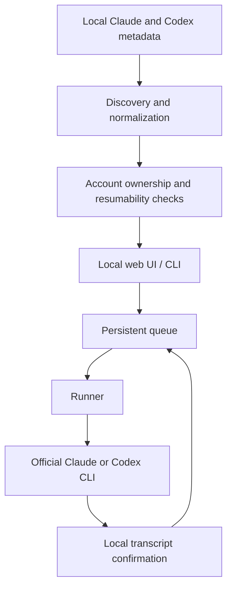

# Architecture

Claude + Codex Queue is a local Python application with two entry points:

- `claude-codex-queue` for discovery, queue management, checks, and execution;
- `claude-codex-queue-web` for the localhost web interface.

The public `claude_codex_queue` package delegates to the original
`claude_vscode_queue` implementation package so existing installations remain
compatible after the project rename.

## Data flow

## Components

### Discovery

`claude_vscode_queue.app` reads supported local indexes and metadata, converts
them into a common chat model, and sorts by the timestamp of the latest real
message. Synthetic markers do not affect ordering.

Large Codex transcripts are not scanned during the normal list operation.
Discovery uses the task index and state database, then reads a transcript only
when execution or limit confirmation needs it.

### Queue and recovery

Queue state is JSON stored under the detected Windows user profile. Items carry
their session identity, provider, prompt, priority, attempts, execution
settings, and a settings fingerprint.

The runner preserves FIFO order within each priority. A rate-limit response
creates recovery state without consuming the queued prompt. Recovery waits for
the parsed reset plus a safety delay, sends `continua`, and returns to the
pending prompt only after the interrupted session can proceed.

### Provider execution

Claude sessions resume through the official Claude Code executable. Codex tasks
resume through `codex exec resume`. The child environment removes external API
authentication overrides so the locally authenticated CLI account remains the
source of truth.

### Web UI

The web server uses Python's standard-library HTTP server and binds to
`127.0.0.1` by default. It serves one dependency-free HTML application and a
small JSON API. Controls are derived from the server's actual resumability and
account checks; view-only actions are disabled rather than allowed to fail
later.

## Safety invariants

- Never consume the next queued prompt as the recovery probe.
- Never enable bypass permissions implicitly.
- Never silently change model, effort, sandbox, approval, or permission mode.
- Never use an external API key accidentally inherited from the environment.
- Never expose the web UI beyond localhost by default.
- Never persist raw authentication material in queue state.

Changes touching these invariants require focused tests and explicit review.
