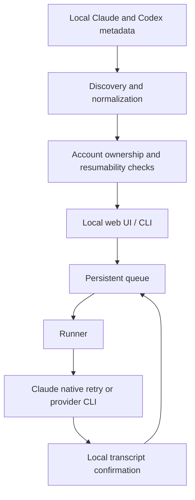

# Architecture

Claude + Codex Queue is a local Python application with two entry points:

- `claude-codex-queue` for discovery, queue management, checks, and execution;
- `claude-codex-queue-web` for the localhost web interface.

The public `claude_codex_queue` package delegates to the original
`claude_vscode_queue` implementation package so existing installations remain
compatible after the project rename.

## Data flow

## Components

### Discovery

`claude_vscode_queue.app` reads supported local indexes and metadata, converts
them into a common chat model, and sorts by the timestamp of the latest real
message. Synthetic markers do not affect ordering.

Large Codex transcripts are not scanned during the normal list operation.
Discovery uses the union of the task index, state database and rollout paths,
filters internal subagent threads, and drops append-only index ghosts. It reads
a transcript only when execution or limit confirmation needs it.

### Multi-account replication

Claude Desktop replication stores lifecycle observations in
`desktop-sync-state.json`. A logical session has a canonical `active`,
`archived` or `deleted` state plus per-account replica observations. Delete
requires two complete scans, writes its tombstone before removing anything and
never deletes the underlying `.claude/projects` transcript. Every overwritten
or removed Claude metadata file is backed up under
`account-transfer-backups/`.

Codex uses one local store per Windows profile, so account copies must have
different thread IDs. The transfer action calls app-server `thread/fork` while
the destination ChatGPT-authenticated account is active and records the linked
IDs in `accounts.json`. Lifecycle propagation is limited to those explicit
links and delegates to the stable Codex CLI commands. SQLite,
`session_index.jsonl` and rollout JSONL files remain provider-owned.

The web process owns a ten-second account lifecycle monitor. It invokes both
provider synchronizers independently of browser polling and invalidates the
chat cache whenever a replica changes.

Account and Claude sync transactions use a process-local reentrant lock plus an
OS file lock. Malformed durable state is an error, never an empty-state signal.
Codex lifecycle work is recorded as pending when the linked copy belongs to an
inactive account and is retried after that account becomes active.

### Queue and recovery

Queue state is JSON stored under the detected Windows user profile. Items carry
their session identity, provider, prompt, priority, attempts, execution
settings, and a settings fingerprint.

The runner preserves FIFO order within each priority. A rate-limit response
creates recovery state without consuming the queued prompt. Recovery waits for
the parsed reset plus a safety delay, inspects provider-specific turn state and
returns to the pending queue only after the interrupted session can proceed.

Claude Desktop Code recovery resolves the app-local session ID, opens it with
`claude://code/<session-id>` and invokes its native `Try again` button through
Windows UI Automation. Codex recovery reads turns through app-server. It uses
`thread/rollback` only for trailing turns with no agent progress, then replays
the original text through the normal authenticated CLI; interrupted work that
already has agent activity receives `continua`. Additional failed prompts are
persisted as ordered, high-priority queue items. Rollback plans are stored before
execution and verified against turn IDs so a restart cannot apply them twice.
Each auto-continue activation also has a durable cancellation marker. Queue
writes are serialized, so a runner holding stale state cannot re-enable a
monitor after it has been disabled; cancellation is checked again immediately
before dispatch.

### Provider execution

Claude queue messages resume through the official Claude Code executable, while
Claude Desktop auto-recovery invokes the app's own retry control. Codex tasks
resume through `codex exec resume`; history replacement uses app-server
`thread/rollback`. The child environment removes external API
authentication overrides so the locally authenticated CLI account remains the
source of truth.

### Web UI

The web server uses Python's standard-library HTTP server and binds to
`127.0.0.1` by default. It serves one dependency-free HTML application and a
small JSON API. Controls are derived from the server's actual resumability and
account checks; view-only actions are disabled rather than allowed to fail
later.

## Safety invariants

- Never consume the next queued prompt as the recovery probe.
- Never replace Claude Desktop `Try again` with a newly created prompt.
- Never replay a failed Codex user message before its failed turn is rolled back.
- Never let a stale runner write resurrect a disabled auto-continue activation.
- Never enable bypass permissions implicitly.
- Never silently change model, effort, sandbox, approval, or permission mode.
- Never use an external API key accidentally inherited from the environment.
- Never expose the web UI beyond localhost by default.
- Never persist raw authentication material in queue state.
- Never write Codex SQLite, task indexes or rollout files directly.
- Never recreate a tombstoned Claude session from a surviving transcript.
- Never propagate a deletion from an empty or unreadable Codex store.

Changes touching these invariants require focused tests and explicit review.
